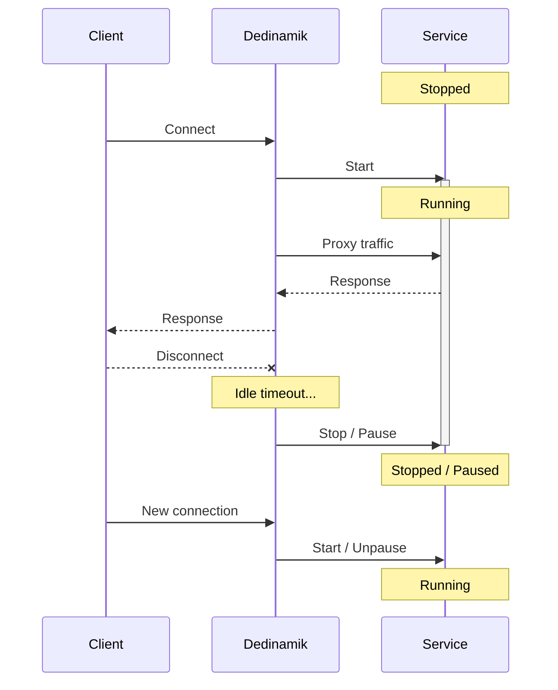

<p align="center">
  <h1 align="center">Dedinamik</h1>
  <p align="center">
    <strong>On-demand service proxy for resource-constrained servers</strong>
  </p>
  <p align="center">
    <a href="https://github.com/skyforce77/dedinamik/actions"></a>
    
    <a href="LICENSE"></a>
  </p>
</p>

---

Dedinamik is a lightweight TCP/HTTP proxy that **starts services on-demand** when traffic arrives, and **stops or freezes them** after a period of inactivity. Perfect for running multiple services on a small dedicated server without wasting resources when they're idle.

## How it works



## Features

| Feature | Description |
|---------|-------------|
| **TCP Proxy** | Transparent bidirectional TCP forwarding with connection tracking |
| **HTTP Reverse Proxy** | On-demand HTTP proxy with automatic service startup |
| **Child Process** | Manage services as child processes with optional SIGSTOP/SIGCONT freezing |
| **Systemd** | Start/stop systemd units via D-Bus |
| **Docker** | Single container management with pause/unpause support |
| **Docker Compose** | Multi-container stack orchestration (start/stop/pause entire stacks) |
| **Graceful Shutdown** | Clean shutdown on SIGINT/SIGTERM with context propagation |

## Quick start

### Build

```bash
go build -o dedinamik ./cmd/dedinamik/
```

### Configure

Drop JSON config files in the `configs/` directory. Each file defines one managed service.

### Run

```bash
./dedinamik
```

## Plugin types

### `child` -- Managed process

Spawns a process directly. Supports freezing via SIGSTOP/SIGCONT.

```json
{
  "name": "bungeecord",
  "type": "child",
  "waitTime": 2,
  "await": [
    { "type": "socket", "connection": "tcp", "from": ":25578", "to": "localhost:25577" }
  ],
  "config": {
    "command": ["/usr/bin/java", "-jar", "/srv/Bungee/BungeeCord.jar"],
    "home": "/srv/Bungee",
    "freeze": false
  }
}
```

### `systemd` -- Systemd unit

Controls a systemd service via D-Bus.

```json
{
  "name": "typhoonlimbo",
  "type": "systemd",
  "waitTime": 2,
  "await": [
    { "type": "socket", "connection": "tcp", "from": ":25566", "to": "localhost:25565" }
  ],
  "config": {
    "service": "typhoonlimbo.service",
    "mode": "replace"
  }
}
```

### `docker` -- Single container

Manages a Docker container with pause/unpause for sleep.

```json
{
  "name": "plex",
  "type": "docker",
  "waitTime": 30,
  "await": [
    { "type": "socket", "connection": "tcp", "from": ":32400", "to": "localhost:32401" }
  ],
  "config": {
    "image": "plexinc/pms-docker:latest",
    "containerName": "plex",
    "env": ["PLEX_CLAIM=claim-xxxx", "TZ=Pacific/Tahiti"],
    "volumes": ["/srv/plex/config:/config", "/srv/media:/data"],
    "network": "host",
    "ports": ["32401:32400"]
  }
}
```

### `compose` -- Docker Compose stack

Orchestrates a full multi-container stack. Great for media servers.

```json
{
  "name": "mediastack",
  "type": "compose",
  "waitTime": 30,
  "await": [
    { "type": "http", "from": ":8080", "to": "http://localhost:32400/web" }
  ],
  "config": {
    "composeFile": "/srv/media/docker-compose.yml",
    "projectName": "mediastack"
  }
}
```

## Configuration reference

### Top-level fields

| Field | Type | Description |
|-------|------|-------------|
| `name` | string | Display name for logging |
| `type` | string | Plugin type: `child`, `systemd`, `docker`, `compose` |
| `waitTime` | int | Minutes of inactivity before sleep/stop |
| `await` | array | List of activity listeners (triggers) |
| `config` | object | Plugin-specific configuration |

### Await types

**Socket** -- TCP/UDP proxy that tracks connections as activity:
```json
{ "type": "socket", "connection": "tcp", "from": ":8080", "to": "localhost:8081" }
```

**HTTP** -- HTTP reverse proxy with per-request activity tracking:
```json
{ "type": "http", "from": ":8080", "to": "http://localhost:8081" }
```

## Project structure

```
dedinamik/
  cmd/dedinamik/         Entry point
  internal/
    activity/            TCP & HTTP proxy listeners
    monitor/             Idle timeout watcher
    plugin/              Plugin system & config loader
    service/             Plugin implementations (child, systemd, docker, compose)
  configs/               Service config files (JSON)
```

## License

[MIT](LICENSE)
